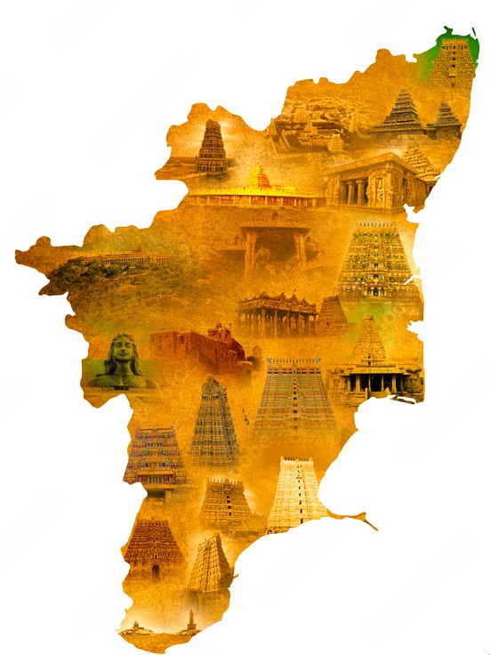

# Ex04 Places Around Me
## Date: 
07/04/2024
## AIM
To develop a website to display details about the places around my house.

## DESIGN STEPS

### STEP 1
Create a Django admin interface.

### STEP 2
Download your city map from Google.

### STEP 3
Using ```<map>``` tag name the map.

### STEP 4
Create clickable regions in the image using ```<area>``` tag.

### STEP 5
Write HTML programs for all the regions identified.

### STEP 6
Execute the programs and publish them.

## CODE
# ImageMap.html:
```
<!DOCTYPE html>
<html lang="en">
<head>
    <meta charset="UTF-8">
    <meta name="viewport" content="width=device-width, initial-scale=1.0">
    <title>IMAGEMAP</title>
</head>
<body>
    <center></center>
    

    <MAP name="MapNew" >
        
        <area shape="RECT" coords="480,30,550,105" href="chennai.html" title="Chennai">
        <area shape="RECT" coords="440,100 530,160" href="kanchipuram.html" title="kanchipuram">
        <area shape="RECT" coords="320,105,410,160" href="tiruvanamalai.html" title="Tiruvanamalai">
        <area shape="RECT" coords="200,135,270,180" href="krishnagiri.html" title="Krishnagiri">
        <area shape="RECT" coords="230,130,360,220" href="dharmapuri.html" title="dharmapuri">
        <area shape="RECT" coords="390,180,490,232" href="villupuram.html" title="villupuram">
        <area shape="RECT" coords="77,250,220,310" href="erode.html" title="erode">
        <area shape="RECT" coords="100,375,190,450" href="coimbatore.html" title="Coimbatore">
        <area shape="RECT" coords="300,510,380,600" href="rameshwaram.html" title="Rameswaram">
        <area shape="RECT" coords="390,255,480,350" href="chidambarm.html" title="chidambarm">
        <area shape="RECT" coords="250,250,370,320" href="salem.html" title="salem">
        <area shape="RECT" coords="215,440,280,530" href="madurai.html" title="madurai">
        <area shape="RECT" coords="390,350,485,430" href="tanjavur.html" title="tanjavur">
        <area shape="RECT" coords="300,410,390,510" href="srirangam.html" title="srirangam">
        <area shape="RECT" coords="140,690,230,740" href="kanniyakumari.html" title="Kanniyakumari">
        <area shape="RECT" coords="215,615,260,680" href="tiruchendur.html" title="Thiruchendur">
        <area shape="RECT" coords="150,580,210,650" href="tenkasi.html" title="Tenkasi">
        <area shape="RECT" coords="150,480,217,550" href="theni.html" title="Theni">
        <area shape="RECT" coords="270,310,385,390" href="thirucarapalli.html" title="thirucarapalli">
        
    </MAP> <br>
</body>
</html>

```

## OUTPUT


## RESULT
The program for implementing image maps using HTML is executed successfully.
